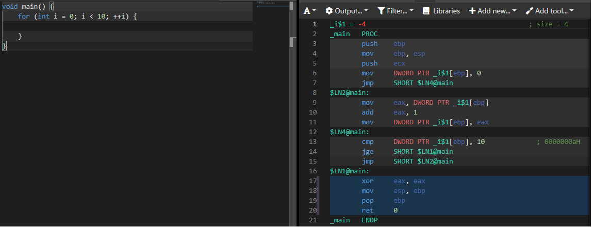

# Example 005 For Loop

## Description

As briefly mentioned in [example 4](../004_jmp/004_jmp.md), there exist conditional jumps in the x86 instruction set. In this example we use a one of these, `jl` (jump if less) to implement a for loop. I think this is somewhat close to what's going on under the hood of an actual for-loop in say C++, and looking at the output of the [compiler explorer] of a disassembled C++ for loop, it is indeed very similar, but with a bit more book keeping:

As you can see, `cmp` is used to check if the loop should be terminated. In this case, `jge` (jump if greater than or equal to) is used instead of `jl`, but the result is the same. The additional differences are mostly semantic.

## Notes

### EFLAGS register

As we talked about in a previous example, the x86 processor architecture includes a couple of general purpose registers, but it also defines a register, called the EFLAGS register, for storing flags. See vol. 1, ch. 3.4.3 in the [intel manual][intel]. On a 32-bit system, the register is 32-bit wide and the bits in it is seperated into three different types; status flags, control flags and system flags. Some of the positions are empty for backward and forward compatability reasons. The flags that are of most interest in this case are the status flags, since they are the ones that indicates the result of an arithmetic instruction. These bits are:

| Bit           | Function |
| :---          | :---   |
| __CF (bit 0)__  | __Carry flag__ - Set if an operation generates a carry or overflow |
| __PF (bit 2)__  | __Parity flag__ -  Set if the least-significant byte of the result contains an even number of 1 bits |
| __AF (bit 4)__  | __Auxiliary Carry flag__ - Set if an operation generates a carry or overflow out of bit 3 |
| __ZF (bit 6)__  | __Zero flag__ - Set if the result is 0 |
| __SF (bit 7)__  | __Sign flag__ - Set equal to the most-significant bit of the result (0 = positive, 1 = negative) |
| __OF (bit 11)__ | __Overflow flag__ -  Set if the integer result is too large to fit in the destination operand |

### cmp

The reason why the result of an arithmetic instruciton is of interest in this example is that a `cmp` instruction is really a `sub` (subtraction) instruction, with the difference that with a `cmp`, the result is discarded. As you can see in the above table, when the `cmp` operation is performed, depending on the result, certain flags will be set to certain values. As a matter of fact, all of the above flags are affected by a `cmp` instruction. See vol. 1 app. A of the [intel manual][intel].

Knowing the above, if a comparison operation between two values equals true, then the `ZF` flag will be set to 0, and if not, it will be set to 1. In our case, we are checking for less than, which is indicated by the `SF` flag. If the result is negative (less than), then the `SF` flag will be set to 1. Looking at the manual, the conditional check also takes the `OF` flag into account, to check for overflows, which makes a lot of sense. See vol. 1 app. B of the [intel manual][intel] for a really good table on condition codes.

### jl

As described in the previous section, the `l` (less) opcode checks the `ZF` and `OF` flags, like `(SF XOR OF) = 1`. If true, then the condition is met. The other part of the instruction, the `j`, is the operation that should be performed if the condition is met, that is to do a `jmp` to the address/label that follows it.

See the [jmp quick reference] for more info.

### `inc` and `add`

This example also includes two additional general instructions, `inc` and `add`. I won't go into detail of how they work, but it very much has to do with performing arethmetic operations, storing the resuts, and setting flags accordingly. `inc` stands for increment (AKA `++` in C) and `add` is ofcourse an addition.

## Additional thoughts

I have been thinking a bit about how the processor processes instructions. It often goes something like:

1. set some register(s) to specific values
1. execute an opcode (interrupt, instruction)
1. as a result of the operation, some other register might be set that we can then read

I actually find this concept, that both I/O and branching seem to follow, quite intuitive. I guess it has to do with the underling processor hardware, where the transistors first needs to be set to either high or low before they can be acted on, or something to that effect. I can see how it would be some what challenging to scale this across many files and functions, but this kind of a model makes a lot of sense.

I have been thinking about the I/O models of different execution environments. Say for example how I/O is handled in C# and NodeJS applications. In C#, we have the more traditional synchronous multi-threaded environment and in NodeJS we have the single-threaded non-blocking IO model. I would argue that any operation with side effects (database operations, user input, long-running tasks etc) is much more gracefully handled in a NodeJS context. Working with x86 assembly, the I/O model "feels" a lot closer to that of NodeJS, even though technically they are probably worlds apart - interesting!

[intel]: https://software.intel.com/content/www/us/en/develop/download/intel-64-and-ia-32-architectures-sdm-combined-volumes-1-2a-2b-2c-2d-3a-3b-3c-3d-and-4.html
[jmp quick reference]: http://unixwiz.net/techtips/x86-jumps.html
[compiler explorer]: https://godbolt.org/